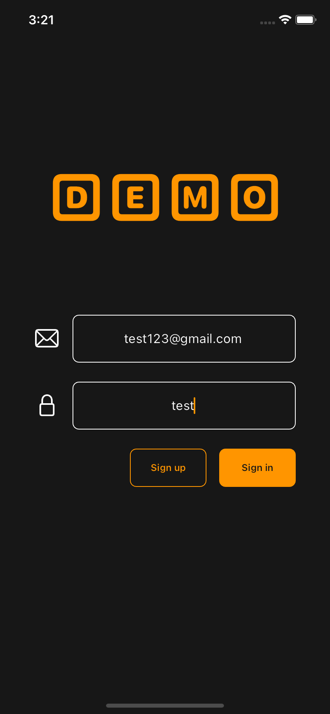
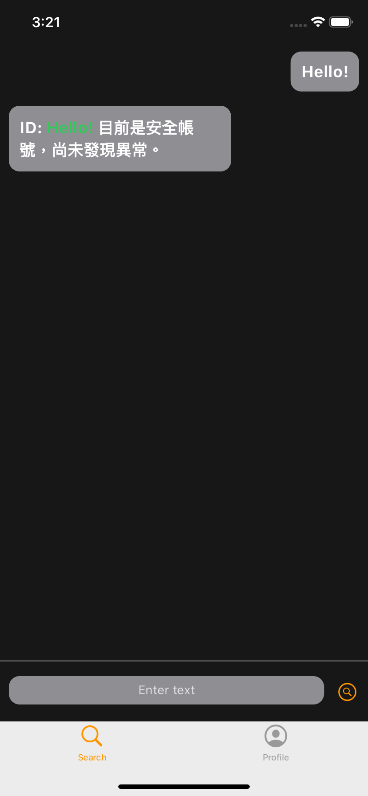
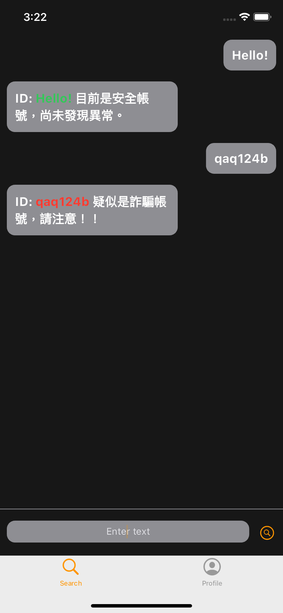
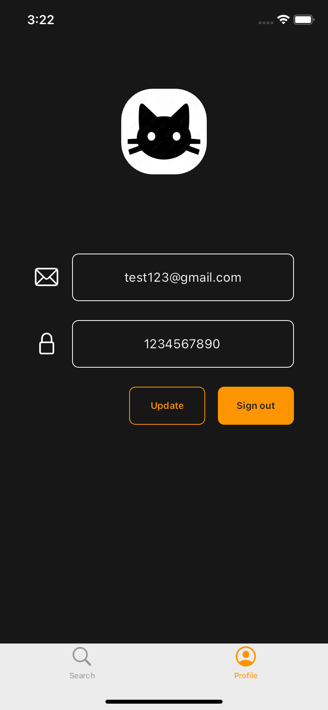
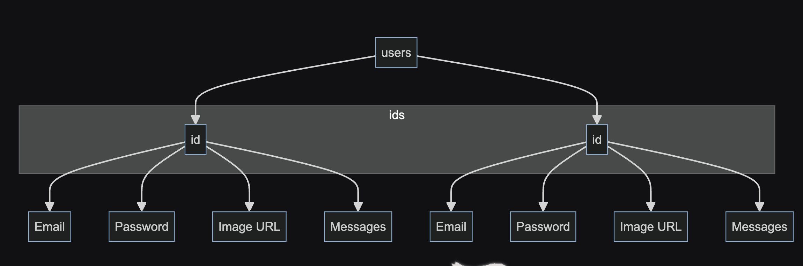

# Fraudster Searcher


## Description

A simple app can search whether the account's id is a fraudster.

## Features

### Account Fraud Check

* **Description**: Allows users to search for an account's ID to determine if it belongs to a fraudster.
* **Implementation**: Utilizes a database or API to check the input ID against a list of known scam or fraudulent accounts.

### Splash Animation

* **Description**: An engaging animation displayed during the app's startup to provide a visually appealing introduction.
* **Implementation**: Developed using animation libraries or frameworks to create a smooth and captivating opening effect.
* **Preview**: [Click here](https://youtube.com/shorts/tMOayjJjhhk?feature=share)

### Sign In and Sign Up Page

* **Description**: Provides interfaces for users to log in or sign up for the app.
* **Implementation**: Includes secure input fields for credentials, validation checks, and error handling.
* **Preview**: 
  

### Loading Animation

* **Description**: A loading animation displayed to users during data fetching or processing to indicate progress.
* **Implementation**: Utilizes loading spinners or progress bars to enhance user experience.
* **Preview**: [Click here](https://youtube.com/shorts/8kfF4dKxgr0?feature=share)

### Search Page

* **Description**: The main interface where users can input an account ID to perform a fraud check.
* **Implementation**: Provides a search bar or input field, along with feedback on search results.
* **Screenshots**: 
  
  

### Profile Page

* **Description**: A page where users can manage their profile settings and view their account details. The feature allowing users to upload their photos is planned to be completed in the future.
* **Functionality**:
  * **Change Password**: Allows users to securely update their account password.
  * **Log Out**: Enables users to log out of their account.
* **Screenshot**: 
  

### Account Data Storage to Firestore Database

* **Description**: Stores user account data including account ID, password, messages, and profile picture in Firestore Database.
* **Implementation**: Utilizes Firestore to securely store and manage user account information.
* **Preview**: 
  


## How to run

1. Clone the repository:
   ```bash
   git clone https://github.com/poyen0806/line-pre-assessment.git
   ```
2. Install the flutter dependencies:
   ```bash
   flutter pub get
   ```
3. Choose the device that you want to connect, such like iOS simulator or real iPhone
4. Run the app
   ```bash
   flutter run
   ```

## Resources

- Logo: https://as1.ftcdn.net/v2/jpg/02/06/74/22/1000_F_206742233_sxv7K1GPkN5VaUcZwRd07gU8fQ63nhTV.jpg
- Firebase: https://console.firebase.google.com
- Cached Network Image: https://pub.dev/packages/cached_network_image